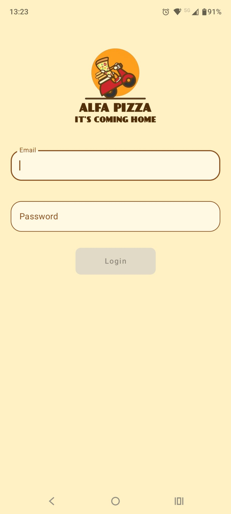
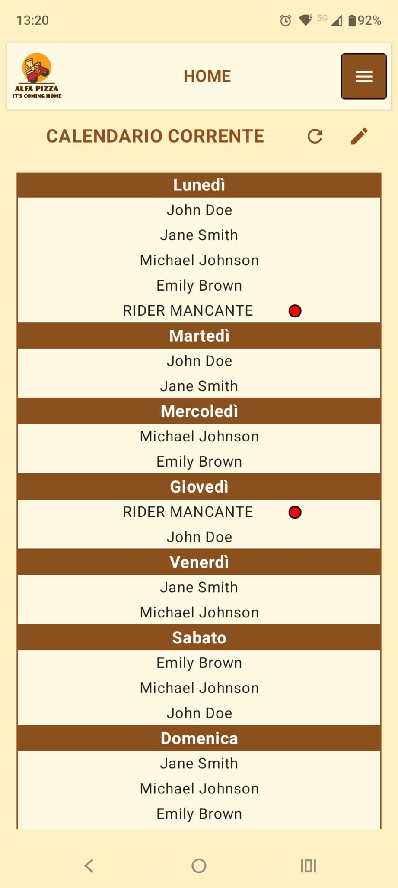

# AlfaPizza

AlfaPizza è un sistema per organizzare i turni settimanali dei rider di una pizzeria. Il progetto comprende un'app Android per amministratori e rider, un backend REST in Node.js e un database MongoDB.

Il backend gestisce autenticazione, autorizzazioni, calendari, vincoli e richieste di cambio turno. L'app Android presenta le operazioni disponibili in base al ruolo dell'utente autenticato.

## Screenshot dell'applicazione

|  |  |
| :---: | :---: |
|  |  |
|  |  |

## Funzionalità

- Gestione separata del calendario corrente e di quello della settimana successiva.
- Generazione automatica dei turni in base a copertura giornaliera, minimo e massimo settimanale e vincoli dei rider.
- Modifica manuale delle assegnazioni e segnalazione di turni scoperti o distribuzioni non valide.
- Inserimento di vincoli assoluti, preferenze e vincoli permanenti.
- Richieste di cambio turno con accettazione da parte di un secondo rider e decisione finale dell'amministratore.
- Gestione dei rider e dei relativi dati di accesso.
- Aggiornamento di email, telefono e password.
- Interfaccia in italiano e inglese, avvisi interni e rilevamento dello stato offline.

## Architettura

| Livello | Tecnologie | Responsabilità |
| --- | --- | --- |
| App Android | Kotlin, Jetpack Compose, ViewModel, Volley | Interfaccia, navigazione per ruolo e chiamate HTTP |
| Backend | Node.js, Express, Mongoose, bcryptjs | API REST, autenticazione, regole operative e automazioni |
| Database | MongoDB | Utenti, calendari, vincoli, swap, sessioni e stato delle automazioni |
| Pianificazione | GitHub Actions o scheduler HTTPS | Rotazione settimanale protetta da un segreto |

L'app usa una singola `MainActivity`; l'indirizzo del backend viene inserito in `BuildConfig` durante la compilazione. Il server conserva soltanto l'hash SHA-256 dei token di sessione, mentre l'app salva il token tramite `EncryptedSharedPreferences`.

MongoDB deve supportare le transazioni perché la rotazione settimanale aggiorna più collezioni in modo atomico. Un cluster MongoDB Atlas è compatibile con questo requisito.

## Ruoli e flussi operativi

### Amministratore

L'amministratore può:

- creare ed eliminare rider;
- configurare numero di turni giornalieri, minimo, massimo e giorno di pubblicazione;
- generare o modificare i calendari corrente e successivo;
- consultare le anomalie delle assegnazioni;
- approvare o rifiutare le richieste di cambio turno già accettate da un rider.

Alla creazione di un rider, l'app genera un codice numerico di sei cifre e una password numerica di otto cifre. La password viene mostrata una sola volta dopo il salvataggio.

### Rider

Il rider può:

- consultare il calendario corrente e quello successivo dopo il giorno di pubblicazione;
- inserire o rimuovere i vincoli della settimana successiva entro il giorno di pubblicazione incluso;
- consultare in sola lettura i vincoli della settimana corrente;
- creare, accettare o annullare richieste di cambio turno compatibili;
- aggiornare email, telefono e password.

### Calendari, vincoli e cambi turno

Il sistema usa indici da `0` a `6`, da lunedì a domenica. Il calendario successivo diventa visibile ai rider quando il giorno corrente raggiunge `publicationDay`; lo stesso valore rappresenta l'ultimo giorno utile per modificare i vincoli futuri.

Durante la generazione, un vincolo con priorità `1` esclude il rider da quel giorno, mentre la priorità `2` è una preferenza non vincolante. Il massimo settimanale e l'assegnazione di un solo turno al giorno sono limiti rigidi; il minimo settimanale è un obiettivo. Se non esistono rider disponibili, il turno resta scoperto.

La rotazione settimanale sposta calendario, configurazione, vincoli e swap dalla settimana successiva a quella corrente, conserva i vincoli permanenti e genera il nuovo calendario futuro. L'operazione è idempotente per settimana.

## Configurazione

### Requisiti

- Node.js e npm per il backend.
- Un database MongoDB raggiungibile e compatibile con le transazioni.
- JDK 17 e Android SDK 35 per compilare l'app.
- Android 7.0 o successivo sul dispositivo (`minSdk 24`).

### Variabili d'ambiente

Il backend legge direttamente le variabili dell'ambiente; `Server/.env.example` è solo un modello e non viene caricato automaticamente.

| Variabile | Obbligatoria | Default | Uso |
| --- | --- | --- | --- |
| `MONGO_URI` | Sì | Nessuno | URI completa di connessione a MongoDB, incluso il nome del database |
| `PORT` | No | `3000` | Porta HTTP del backend |
| `APP_TIME_ZONE` | No | `Europe/Rome` | Fuso usato per pubblicazione e rotazione |
| `CRON_SECRET` | Per la rotazione pianificata | Nessuno | Segreto richiesto nell'header `x-cron-secret` |
| `SESSION_TTL_HOURS` | No | `168` | Durata delle sessioni in ore |

### Primo amministratore

Il database non contiene credenziali predefinite. Dopo aver installato le dipendenze del server, generare un hash BCrypt:

```bash
cd Server
npm ci
read -s ADMIN_PASSWORD
export ADMIN_PASSWORD
node -e 'const bcrypt = require("bcryptjs"); bcrypt.hash(process.env.ADMIN_PASSWORD, 10).then(console.log)'
unset ADMIN_PASSWORD
```

Nel database indicato da `MONGO_URI`, inserire quindi un documento nella collezione `users`:

```json
{
  "name": "Admin",
  "surname": "AlfaPizza",
  "email": "admin@example.com",
  "phone": "",
  "code": 0,
  "password": "<hash bcrypt>",
  "isAdmin": true
}
```

L'email deve essere in minuscolo e il codice deve essere univoco.

### App Android

Creare `App/local.properties`:

```properties
sdk.dir=/percorso/del/tuo/Android/sdk
BASE_URL=https://api.example.com
```

`BASE_URL` deve puntare al backend tramite HTTPS e non deve terminare con `/`.

## Avvio locale

Clonare il repository:

```bash
git clone https://github.com/Alessio-Colantoni/AlfaPizza.git
cd AlfaPizza
```

Avviare il backend dopo aver configurato MongoDB:

```bash
cd Server
npm ci
export MONGO_URI='mongodb://host:porta/AlfaPizza'
export APP_TIME_ZONE='Europe/Rome'
npm start
```

Il servizio risponde su `http://localhost:3000`; `GET /api/health` restituisce `200` quando MongoDB è connesso.

Per compilare l'app, configurare `App/local.properties` e usare il wrapper Gradle:

```bash
cd App
./gradlew :app:assembleDebug
```

L'APK viene generato in `App/app/build/outputs/apk/debug/app-debug.apk`.

## Installazione su server

Il backend può essere installato su qualsiasi servizio Node.js con accesso a MongoDB e terminazione HTTPS.

### Esempio Render

1. Creare un nuovo Web Service collegato al repository.
2. Impostare `Server` come Root Directory.
3. Usare `npm ci` come Build Command e `npm start` come Start Command.
4. Configurare almeno `MONGO_URI`; aggiungere `APP_TIME_ZONE`, `SESSION_TTL_HOURS` e `CRON_SECRET` se necessari.
5. Impostare `/api/health` come Health Check Path.

Per la rotazione automatica, pianificare ogni lunedì una richiesta a:

```text
GET https://URL_DEL_SERVER/api/cron/rotate-week
x-cron-secret: valore-di-CRON_SECRET
```

Il workflow `.github/workflows/cron-tasks.yml` può svolgere questa operazione. Prima di usarlo con una nuova istanza occorre sostituire l'URL già presente nel file e configurare il repository secret `CRON_SECRET` con lo stesso valore del server.

## Struttura del repository

| Percorso | Contenuto |
| --- | --- |
| `App/` | Progetto Android e wrapper Gradle |
| `App/app/src/main/java/` | Modelli, schermate, rete e ViewModel |
| `Server/` | Backend Express e configurazione npm |
| `Server/.env.example` | Modello delle variabili del backend |
| `.github/workflows/cron-tasks.yml` | Pianificazione delle operazioni settimanali |
| `assets/` | Immagini usate nel README |
